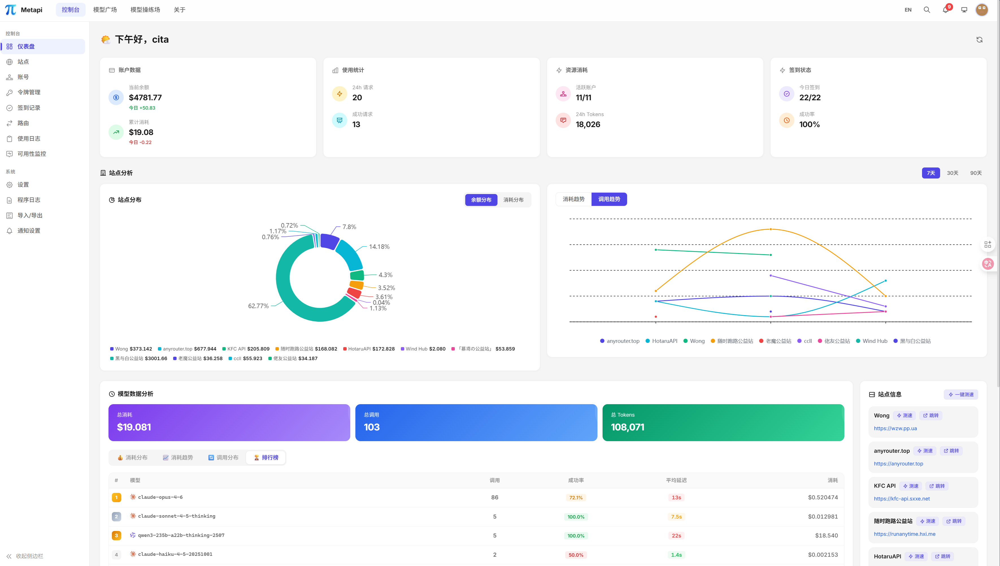
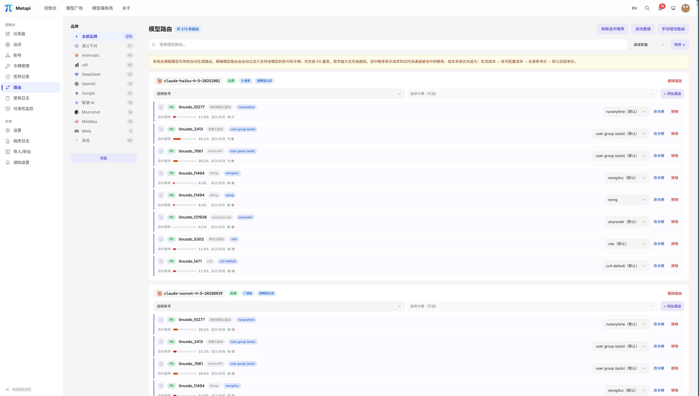
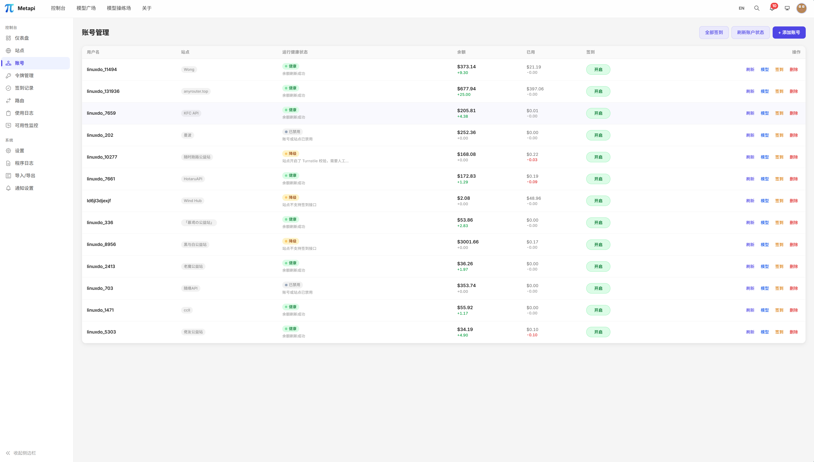
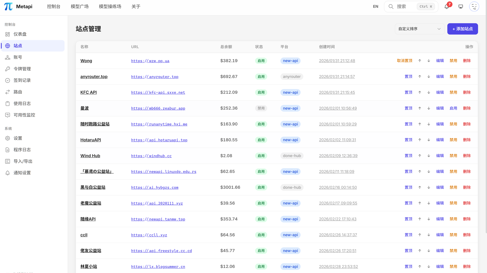
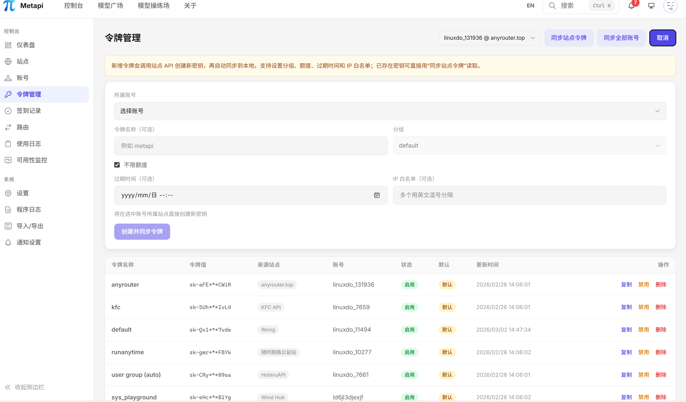
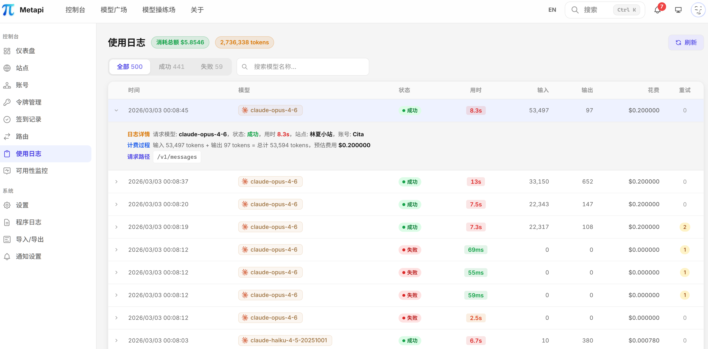
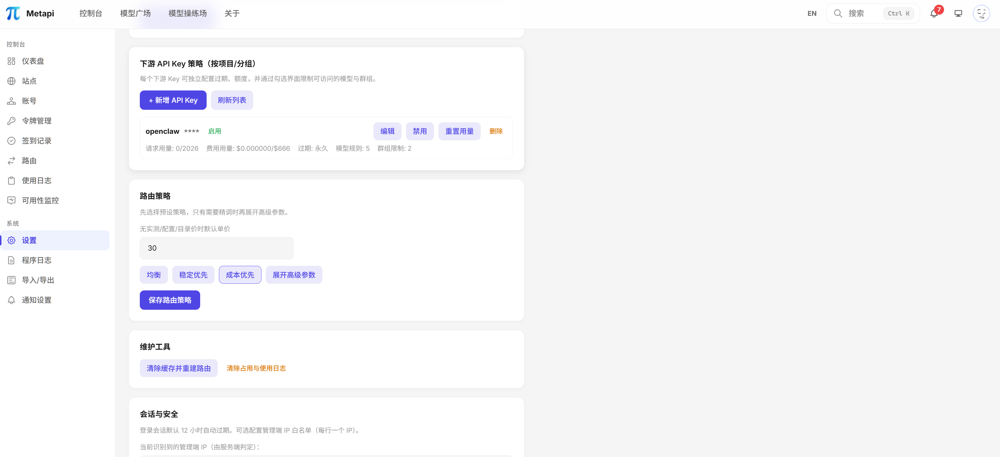
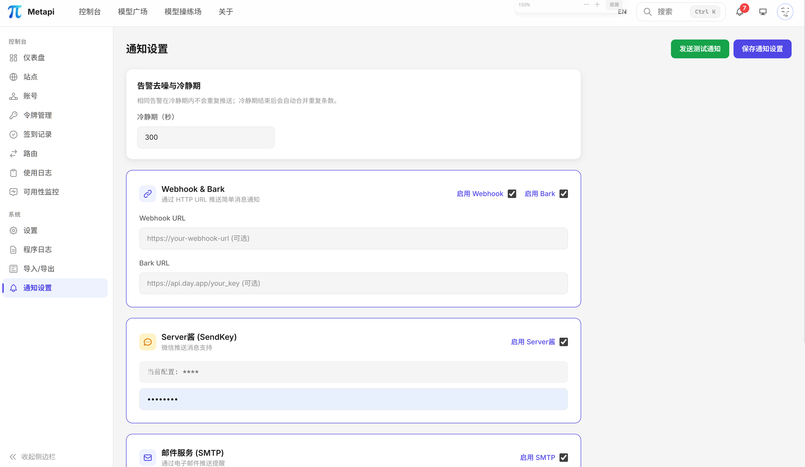
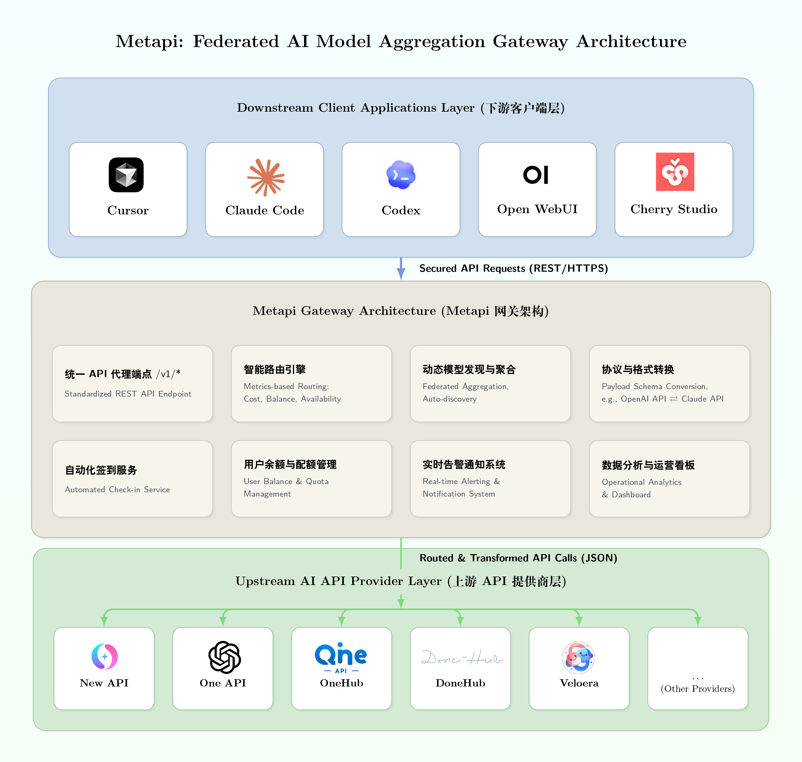
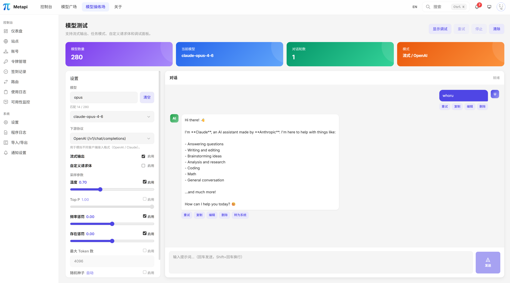

<div align="center">


**中转站的中转站 — 将分散的 AI 中转站聚合为一个统一网关**

<p>
统一接入 OpenAI、Claude、Gemini 上游连接，
<br>
提供 <strong>一个 API Key、一个入口</strong>，自动发现模型、智能路由、成本最优。
</p>


<p align="center">
<a href="https://github.com/cita-777/metapi/releases">
  
</a><a href="https://github.com/cita-777/metapi/stargazers">
  
</a><a href="https://github.com/cita-777/metapi/graphs/contributors">
  
</a><a href="https://atomgit.com/cita-777/metapi">
  
</a><a href="https://deepwiki.com/cita-777/metapi">
  
</a><a href="https://hub.docker.com/r/1467078763/metapi">
  
</a><a href="https://hub.docker.com/r/1467078763/metapi">
  
</a>
</p>

<p align="center">
  <a href="README.md"><strong>中文</strong></a> |
  <a href="README_EN.md">English</a>
</p>

<p align="center">
  <a href="https://metapi.cita777.me"><strong>📚 在线文档</strong></a> ·
  <a href="https://metapi.cita777.me/getting-started">快速上手</a> ·
  <a href="https://metapi.cita777.me/deployment">部署指南</a> ·
  <a href="https://metapi.cita777.me/configuration">配置说明</a> ·
  <a href="https://metapi.cita777.me/client-integration">客户端接入</a> ·
  <a href="https://metapi.cita777.me/faq">常见问题</a>
</p>

</div>

---


## 📖 介绍

Metapi 将多个上游连接统一到一个入口，让下游工具可以使用统一的 API Key，并自动发现模型、智能路由。

当前支持的上游协议：

- OpenAI 兼容接口
- Claude / Anthropic 接口
- Gemini / Google AI 接口

详细接法见 [上游接入](./docs/upstream-integration.md)。

---


## 🖼️ 界面预览

<table>
  <tr>
    <td align="center">
      
      <div><b>仪表盘</b> — 余额分布、消费趋势、系统概览</div>
    </td>
    <td align="center">
    </td>
  </tr>
  <tr>
    <td align="center">
      
      <div><b>智能路由</b> — 多通道概率分配、成本优先选路</div>
    </td>
    <td align="center">
      
      <div><b>账号管理</b> — 多站点多账号、健康状态追踪</div>
    </td>
  </tr>
  <tr>
    <td align="center">
      
      <div><b>站点管理</b> — 上游站点配置与状态一览</div>
    </td>
    <td align="center">
      
      <div><b>令牌管理</b> — API Token 生命周期管理</div>
    </td>
  </tr>
  <tr>
    <td align="center">
      
      <div><b>使用日志</b> — 代理请求日志与成本明细</div>
    </td>
    <td align="center">
      
      <div><b>系统设置</b> — 全局参数与安全配置</div>
    </td>
  </tr>
  <tr>
    <td align="center">
      
      <div><b>通知设置</b> — 多渠道告警与推送配置</div>
    </td>
  </tr>
</table>

---

## 🏛️ 架构概览

<div align="center">
  
</div>

---

## ✨ 核心功能

### 🌐 统一代理网关

- 兼容 **OpenAI** 与 **Claude** 下游格式，对接所有主流客户端
- 支持 Responses / Chat Completions / Messages / Completions（Legacy）/ Embeddings / Images / Models，以及标准 `/v1/files` 文件接口
- 完整的 SSE 流式传输支持，自动格式转换（OpenAI ⇄ Claude）

### 🧠 智能路由引擎

- 自动发现所有上游站点的可用模型，**零配置**生成路由表
- 四级成本信号：**实测成本 → 账号配置成本 → 目录参考价 → 默认兜底**
- 多通道概率分摊，基于成本（40%）、余额（30%）、使用率（30%）加权分配
- 失败通道自动冷却与避让（默认 10 分钟冷却期）
- 请求失败自动重试，自动切换其他可用通道
- 路由决策可视化解释，每次选择透明可审计

<div align="center">
  
  <p><sub>智能路由配置界面 — 支持精确匹配、通配符、概率分配等多种路由策略</sub></p>
</div>

### 📡 多平台聚合管理

| 平台 | 适配器 | 说明 |
| --- | --- | --- |
| **OpenAI** | `openai` | OpenAI 兼容接口 |
| **Claude** | `claude` | Claude / Anthropic 接口 |
| **Gemini** | `gemini` | Gemini / Google AI 接口 |

三个适配器覆盖模型发现、代理接入和路由所需的通用能力；具体账号、余额和 Token 能力取决于上游接口。

### 👥 账号与 Token 管理

- **多站点多账号**：每个站点可添加多个账号，每个账号可持有多个 API Token
- **健康状态追踪**：`healthy` / `unhealthy` / `degraded` / `disabled` 四级状态机
- **凭证加密存储**：所有敏感凭证均加密保存在本地数据库中
- **站点联动**：禁用站点自动级联禁用所有关联账号


### 💰 余额管理

- 定时余额刷新（默认每小时），批量更新所有活跃账号
- 收入追踪：每日/累计收入与消费趋势分析
- 余额兜底估算：API 不可用时通过代理日志推算余额变动
- 凭证过期自动重新登录

### 🔔 告警通知

支持五种通知渠道：

| 渠道                   | 说明              |
| ---------------------- | ----------------- |
| **Webhook**      | 自定义 HTTP 推送  |
| **Bark**         | iOS 推送通知      |
| **Server酱**     | 微信通知          |
| **Telegram Bot** | Telegram 消息通知 |
| **SMTP 邮件**    | 标准邮件通知      |

告警场景：余额不足预警、站点/账号异常、代理请求失败、Token 过期提醒。告警冷却机制（默认 300 秒）防止重复通知。

### 📊 数据看板

- 站点余额饼图、每日消费趋势图
- 全局搜索（站点、账号、模型）
- 系统事件日志、代理请求日志（模型、状态、延迟、Token 用量、成本估算）

<div align="center">
  
  <p><sub>数据看板 — 余额分布、消费趋势、系统健康状态一目了然</sub></p>
</div>

### 🎮 模型操练场

- 交互式聊天测试，即时验证模型可用性与响应质量
- 选择任意路由模型，对比不同通道输出
- 流式 / 非流式双模式测试

<div align="center">
  
  <p><sub>模型操练场 — 在线交互测试，验证模型可用性与响应质量</sub></p>
</div>

### 📦 轻量部署

- **单 Docker 容器**，默认本地数据目录部署，支持外接 MySQL / PostgreSQL 运行时数据库
- Docker 镜像支持 `amd64`、`arm64` 和 `armv7l`（`linux/arm/v7`）服务端部署
- 数据完整导入导出，迁移无忧

---

## 🚀 快速开始

### Docker Compose（推荐）

```bash
mkdir metapi && cd metapi

cat > docker-compose.yml << 'EOF'
services:
  metapi:
    image: 1467078763/metapi:latest
    ports:
      - "4000:4000"
    volumes:
      - ./data:/app/data
    environment:
      AUTH_TOKEN: ${AUTH_TOKEN:?AUTH_TOKEN is required}
      PROXY_TOKEN: ${PROXY_TOKEN:?PROXY_TOKEN is required}
      PORT: ${PORT:-4000}
      DATA_DIR: /app/data
      TZ: ${TZ:-Asia/Shanghai}
    restart: unless-stopped
EOF

# 设置 Token 并启动
# AUTH_TOKEN = 管理后台登录令牌（登录时输入此值）
export AUTH_TOKEN=your-admin-token
# PROXY_TOKEN = 下游客户端调用 /v1/* 的 Token
export PROXY_TOKEN=your-proxy-sk-token
docker compose up -d
```

<details>
<summary><strong>一行 Docker 命令</strong></summary>

```bash
docker run -d --name metapi \
  -p 4000:4000 \
  -e AUTH_TOKEN=your-admin-token \
  -e PROXY_TOKEN=your-proxy-sk-token \
  -e TZ=Asia/Shanghai \
  -v ./data:/app/data \
  --restart unless-stopped \
  1467078763/metapi:latest
```

</details>

启动后访问 `http://localhost:4000`，用 `AUTH_TOKEN` 登录即可。

> [!NOTE]
> Docker 镜像支持 `amd64`、`arm64` 和 `armv7l`（`linux/arm/v7`）服务端部署。

<!-- markdownlint-disable-next-line MD028 -->
> [!IMPORTANT]
> 请务必修改 `AUTH_TOKEN` 和 `PROXY_TOKEN`，不要使用默认值。数据存储在 `./data` 目录，升级不会丢失。

> [!TIP]
> 初始管理员令牌即启动时配置的 `AUTH_TOKEN`。
> 若在 Compose 外运行且未显式设置 `AUTH_TOKEN`，默认为 `change-me-admin-token`（仅用于本地调试）。
> 如果在「设置」面板中修改了管理员令牌，后续登录请使用新令牌。

Docker Compose、桌面安装包、反向代理、升级与数据库选项等详见 [部署指南](https://metapi.cita777.me/deployment)。

📖 **[环境变量与配置](https://metapi.cita777.me/configuration)** · **[客户端接入指南](https://metapi.cita777.me/client-integration)** · **[常见问题](https://metapi.cita777.me/faq)**

---

## 🏗️ 技术栈

| 层                   | 技术                                                              |
| -------------------- | ----------------------------------------------------------------- |
| **后端框架**   | [Fastify](https://fastify.dev) — 高性能 Node.js 后端框架            |
| **前端框架**   | [React 18](https://react.dev) + [Vite](https://vitejs.dev)              |
| **语言**       | [TypeScript](https://www.typescriptlang.org) — 端到端类型安全       |
| **样式**       | [Tailwind CSS v4](https://tailwindcss.com) — 原子化样式框架         |
| **数据库**     | SQLite / MySQL / PostgreSQL +[Drizzle ORM](https://orm.drizzle.team) |
| **数据可视化** | [VChart](https://visactor.io/vchart) (@visactor/react-vchart)        |
| **定时任务**   | [node-cron](https://github.com/node-cron/node-cron)                  |
| **容器化**     | Docker (Debian slim) + Docker Compose                             |
| **测试**       | [Vitest](https://vitest.dev)                                         |

---

## 🛠️ 本地开发

```bash
# 安装依赖
npm install

# 数据库迁移
npm run db:migrate

# 启动开发环境（前后端热更新）
npm run dev
```

```bash
npm run build          # 构建前端 + 后端
npm run build:web      # 仅构建前端（Vite）
npm run build:server   # 仅构建后端（TypeScript）
npm test               # 运行全部测试
npm run test:watch     # 监听模式
npm run db:generate    # 生成 Drizzle 迁移文件
```

---

## 🔗 相关项目

### 上游兼容平台

| 项目                                            | 说明                                    |
| ----------------------------------------------- | --------------------------------------- |
| OpenAI | OpenAI 兼容接口 |
| Claude | Claude / Anthropic 接口 |
| Gemini | Gemini / Google AI 接口 |

### 参考和使用的项目

| 项目                                                 | 说明                                                      |
| ---------------------------------------------------- | --------------------------------------------------------- |
| [LLM Metadata](https://github.com/nicepkg/llm-metadata) | LLM 模型元数据库，用于模型描述参考                        |

---

## 🔒 数据与隐私

Metapi 完全自托管，所有数据（账号、令牌、路由、日志）均存储在你自己的部署环境中，不会向任何第三方发送数据。代理请求仅在你的服务器与上游站点之间直连传输。

---

## 🤝 贡献

欢迎各种形式的贡献！

- 🐛 报告 Bug — [提交 Issue](https://github.com/cita-777/metapi/issues)
- 💡 功能建议 — [发起讨论](https://github.com/cita-777/metapi/issues)
- 🔧 代码贡献 — [提交 Pull Request](https://github.com/cita-777/metapi/pulls)
- 📝 贡献指南 — [CONTRIBUTING.md](CONTRIBUTING.md)
- 📜 行为准则 — [CODE_OF_CONDUCT.md](CODE_OF_CONDUCT.md)

---

## 🛡️ 安全

如发现安全问题，请参考 [SECURITY.md](SECURITY.md) 使用非公开方式报告。

---

## 📜 License

[MIT](LICENSE)

---

## 🙏 致谢

感谢所有为 Metapi 提交代码、反馈问题、提供思路和实测数据的朋友。这个项目的很多能力，都是在社区的真实使用和反复打磨中慢慢长出来的。

特别感谢所有贡献者：

<a href="https://github.com/cita-777/metapi/graphs/contributors">
  
</a>

---

## ⭐ Star History

[](https://star-history.dera.page/#cita-777/metapi&type=date&legend=top-left)

---

<div align="center">

**⭐ 如果 Metapi 对你有帮助，给个 Star 就是最大的支持！**

`<sub>`Built with ❤️ by the AI community`</sub>`

</div>
