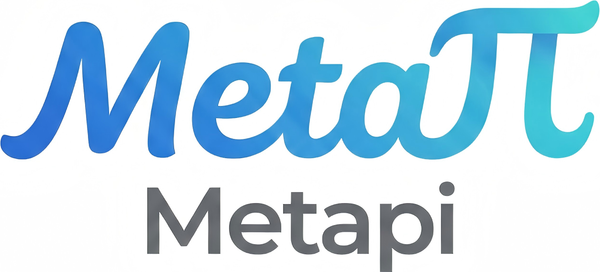

<div align="center">



# Metapi Refactor

**A self-hosted AI API aggregation gateway focused on proxying, routing, and observability.**

Aggregate OpenAI-, Claude-, and Gemini-compatible upstreams behind one endpoint with model discovery, smart routing, and automatic failover.

<p>
  <a href="https://github.com/yang208115/metapi"></a>
  <a href="LICENSE"></a>
  
</p>

<p>
  <a href="README.md">中文</a> · <strong>English</strong> ·
  <a href="docs/getting-started.md">Getting Started</a> ·
  <a href="docs/deployment.md">Deployment</a> ·
  <a href="docs/configuration.md">Configuration</a>
</p>

</div>

> [!IMPORTANT]
> This repository is an independent refactor of [cita-777/metapi](https://github.com/cita-777/metapi), not an official upstream release. The feature scope, database schema, and deployment artifacts have diverged. Please report issues in [this repository](https://github.com/yang208115/metapi/issues).

## Refactor scope

This branch narrows the product around the core gateway path:

```text
downstream request
  -> protocol surface and transformation
  -> route selection and health classification
  -> upstream execution, retry, and failover
  -> usage, cost, request outcomes, and operational logs
```

Key differences from upstream:

- Only the OpenAI, Claude, and Gemini protocol adapters remain in the active platform registry.
- Auxiliary check-in, WebDAV, search/video proxy, desktop, and legacy account-token features were removed.
- Proxy orchestration lives under `src/server/proxy-core/`; HTTP routes remain thin adapters.
- Request telemetry, operational metrics, terminal logs, and database-backed aggregation are first-class features.
- Some legacy database tables and columns remain solely for upgrade/import compatibility.

Use the [upstream project](https://github.com/cita-777/metapi) if you need its complete feature set or prebuilt images.

## Features

- OpenAI Chat Completions, Responses, Completions, Embeddings, Images, Files, Models, and Rerank endpoints.
- Anthropic Messages and token counting, plus native Gemini proxy surfaces.
- Model discovery, exact/pattern routes, weighted channels, retries, cooldowns, and failover.
- Multi-site connection management using session, API key, and supported OAuth credentials.
- Per-client downstream keys with model, quota, and routing policies.
- Dashboard metrics for requests, success rate, TTFT, latency, tokens, and cost.
- Attempt-level proxy logs, request outcomes, and protected live server logs.
- SQLite, MySQL, and PostgreSQL runtime databases.

## Quick start

Node.js 22 or newer is required.

```bash
git clone https://github.com/yang208115/metapi.git
cd metapi

cp .env.example .env
# Set AUTH_TOKEN, PROXY_TOKEN, and ACCOUNT_CREDENTIAL_SECRET in .env

npm ci
npm run db:migrate
npm run dev
```

The development UI is available at `http://localhost:5173`. A production build listens on `http://localhost:4000` by default.

### Docker Compose

The upstream `1467078763/metapi` image is not this refactor. The included Compose file builds the current checkout:

```bash
git clone https://github.com/yang208115/metapi.git
cd metapi
cp .env.example .env

docker compose --env-file .env -f docker/docker-compose.yml up -d --build
```

Open `http://localhost:4000` and sign in with `AUTH_TOKEN`.

> [!WARNING]
> Generate separate secrets for `AUTH_TOKEN`, `PROXY_TOKEN`, and `ACCOUNT_CREDENTIAL_SECRET`. Never commit `.env`.

## Client configuration

Most OpenAI-compatible clients only need:

```text
Base URL: http://localhost:4000/v1
API Key:  <PROXY_TOKEN or a downstream key created in the admin UI>
```

```bash
curl http://localhost:4000/v1/models \
  -H "Authorization: Bearer $PROXY_TOKEN"
```

See [Client Integration](docs/client-integration.md) for Claude, Gemini, and common client examples.

## Project layout

```text
src/
├── server/
│   ├── proxy-core/       # orchestration, executors, surfaces, telemetry
│   ├── routes/           # Fastify management and proxy adapters
│   ├── services/         # routing, accounts, models, logs, aggregation
│   ├── transformers/     # OpenAI / Claude / Gemini transformations
│   └── db/               # Drizzle schema and cross-dialect artifacts
├── web/                  # React admin UI
scripts/
├── dev/                  # schema, drift, and development tooling
└── tests/                # architecture and telemetry tests
docs/                     # VitePress documentation
drizzle/                  # SQLite migration history
```

## Development checks

The delivery contract uses `npm` and `package-lock.json`.

```bash
npm ci
npm run typecheck
npm test
npm run build
npm run docs:build
npm run repo:drift-check
git diff --check
```

Schema changes must update the Drizzle schema, SQLite migration history, and checked-in cross-dialect schema artifacts together.

## Documentation

- [Getting Started](docs/getting-started.md)
- [Upstream Integration](docs/upstream-integration.md)
- [Deployment](docs/deployment.md)
- [Configuration](docs/configuration.md)
- [Client Integration](docs/client-integration.md)
- [Operations](docs/operations.md)
- [Monitoring semantics](docs/operations-monitoring.md)
- [Management API](docs/management-api.md)
- [FAQ](docs/faq.md)

## License and attribution

Licensed under the [MIT License](LICENSE). Thanks to [cita-777/metapi](https://github.com/cita-777/metapi) and its contributors for the original implementation.

### Refactor contributors

<!-- metapi-contributors:start -->
<p align="left">
  <sub>The contributor list can be refreshed with <code>npm run readme:contributors</code> once the repository is publicly reachable.</sub>
</p>
<!-- metapi-contributors:end -->
