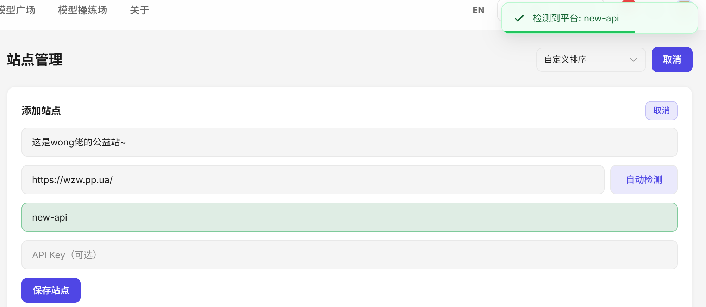
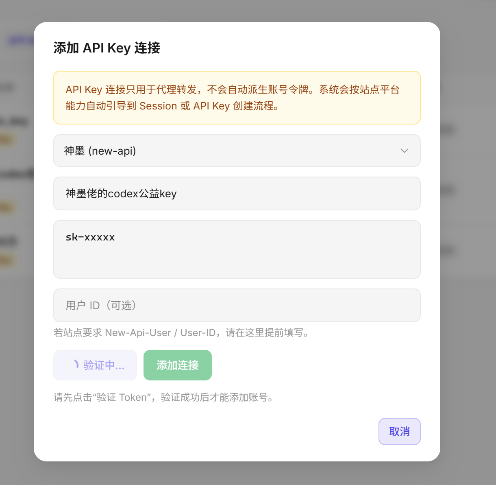
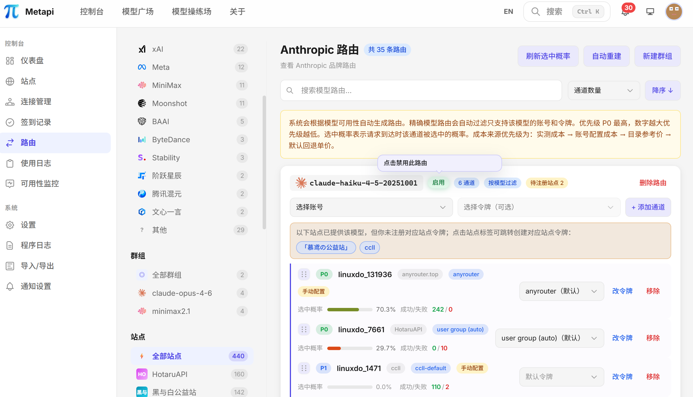
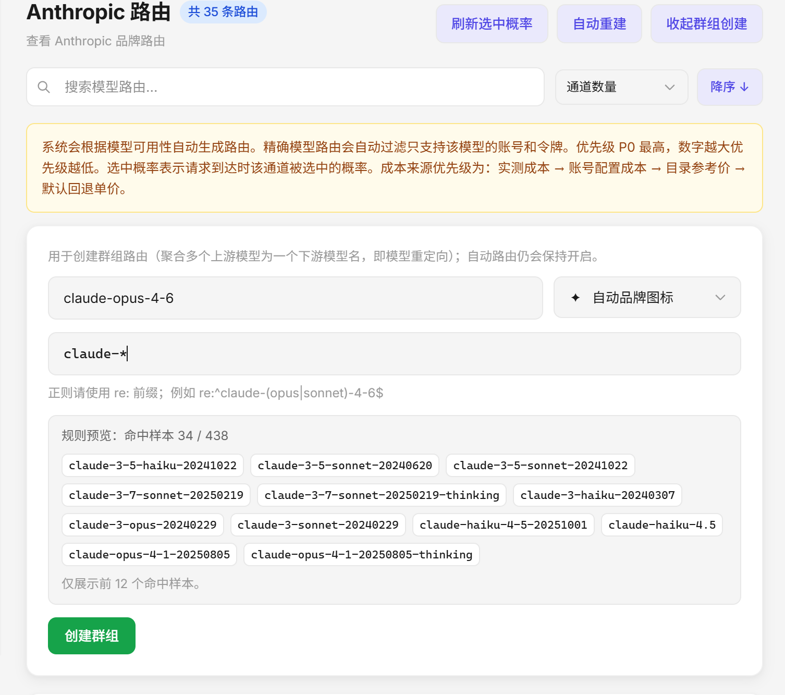
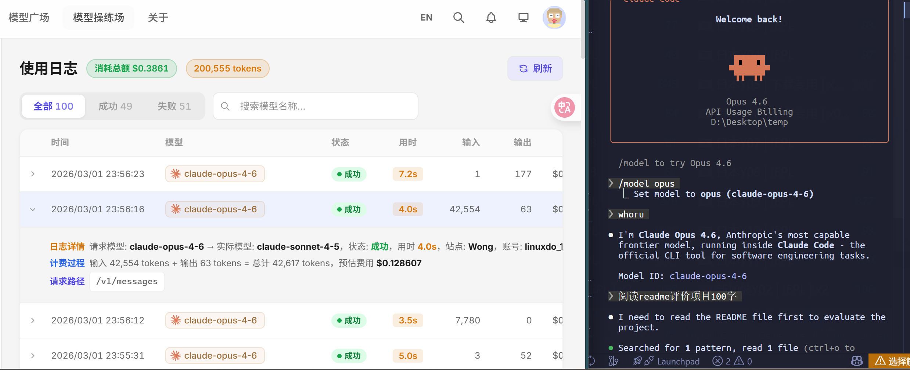

# 🚀 快速上手

本文档帮助你在 10 分钟内完成 Metapi 的首次部署。

[返回文档中心](./README.md)

---

## 前置条件

按你的使用场景准备对应环境：

| 场景 | 推荐方式 | 需要准备 |
|------|----------|----------|
| 云服务器 / NAS / 家用主机长期运行 | Docker / Docker Compose | Docker 与 Docker Compose |
| 二次开发 / 调试 | 本地开发 | Node.js 20+ 与 npm |

> [!NOTE]
> - 当前不再把 `Release` 压缩包 + Node.js 运行时作为独立部署路径。

## 方式一：Docker Compose 部署（推荐）

### 1. 创建项目目录

```bash
mkdir metapi && cd metapi
```

### 2. 创建 `docker-compose.yml`

```yaml
services:
  metapi:
    image: 1467078763/metapi:latest
    ports:
      - "4000:4000"
    volumes:
      - ./data:/app/data
    environment:
      AUTH_TOKEN: ${AUTH_TOKEN:?AUTH_TOKEN is required}
      PROXY_TOKEN: ${PROXY_TOKEN:?PROXY_TOKEN is required}
      PORT: ${PORT:-4000}
      DATA_DIR: /app/data
      TZ: ${TZ:-Asia/Shanghai}
    restart: unless-stopped
```

### 3. 设置令牌并启动

```bash
# AUTH_TOKEN = 管理后台初始管理员令牌（登录后台时输入这个值）
export AUTH_TOKEN=your-admin-token
# PROXY_TOKEN = 下游客户端调用 /v1/* 使用的令牌
export PROXY_TOKEN=your-proxy-sk-token
docker compose up -d
```

### 4. 访问管理后台

打开 `http://localhost:4000`，使用 `AUTH_TOKEN` 的值登录。

> [!TIP]
> 初始管理员令牌就是启动时配置的 `AUTH_TOKEN`。  
> 如果未显式设置（非 Compose 场景），默认值为 `change-me-admin-token`（仅建议本地调试）。  
> 若你在后台「设置」里修改过管理员令牌，后续登录请使用新令牌。
## 方式三：本地开发启动

```bash
git clone https://github.com/cita-777/metapi.git
cd metapi
npm install
npm run db:migrate
npm run dev
```

- 前端地址：`http://localhost:5173`（Vite dev server）
- 后端地址：`http://localhost:4000`
- 这是源码开发流程，不是免 Docker 的成品部署包

## 首次使用流程

完成部署后，按以下顺序配置：

### 步骤 1：添加站点

进入 **站点管理**，添加一个上游接口：

- 填写站点名称和 API Base URL
- 平台类型只选择：`openai`、`claude` 或 `gemini`
- 平台通常可自动检测；如果检测失败，再手动选择
- 可选是否启用系统代理、站点权重和备用 API 地址

三种平台分别对应：

- `openai`：OpenAI 及 OpenAI-compatible 接口
- `claude`：Claude / Anthropic Messages 接口
- `gemini`：Gemini 原生接口或 Google OpenAI-compatible 接口



### 步骤 2：添加 API Key 连接

普通上游直接在连接管理中添加 API Key：

- OpenAI：填写 OpenAI API Key
- Claude：填写 Anthropic API Key
- Gemini：填写 Google AI API Key



### 步骤 3：路由管理

进入 **路由管理**：

- 系统会自动发现模型并生成路由规则
- 点击右上角的刷新选中概率可以显示并将概率载入缓存中
- 可以手动调整通道的优先级和权重
- 关于路由权重参数调优，参考 [配置说明 → 智能路由](/configuration#智能路由)
- 左侧可以进行品牌、站点、接口等的筛选，如下图所示：



- **可以通过创建群组，从而对上游模型进行匹配和重定向，如果建立下图群组，下游访问Metapi时获取的claude-opus-4-6模型将在命中样本中智能选取，日志中可以看见映射。** 

- **可以在使用日志中看见下游的请求模型和实际分配给下游使用的模型**

  

### 步骤 4：验证代理

**Metapi还有更多功能，可以在设置中寻找，请尽情探索，有建议可以提出Issue改进。**

按运行方式选择验证入口：

| 运行方式 | 管理界面 | 代理接口基地址 |
|----------|----------|----------------|
| Docker / Docker Compose | `http://localhost:4000` | `http://localhost:4000` |
| 本地开发 | `http://localhost:5173` | `http://localhost:4000` |

### Docker / 本地开发：直接用 curl 验证

```bash
# 检查模型列表
curl -sS http://localhost:4000/v1/models \
  -H "Authorization: Bearer your-proxy-sk-token"

# 测试对话
curl -sS http://localhost:4000/v1/chat/completions \
  -H "Authorization: Bearer your-proxy-sk-token" \
  -H "Content-Type: application/json" \
  -d '{"model":"gpt-4o-mini","messages":[{"role":"user","content":"hi"}]}'
```


打开托盘菜单的 `Open Logs Folder`，在最新日志里查找类似下面的启动信息：

```text
Dashboard: http://127.0.0.1:4000
Proxy API: http://127.0.0.1:4000/v1/chat/completions
```

如果你没有覆盖端口，可直接执行：

```bash
curl -sS http://127.0.0.1:4000/v1/models \
  -H "Authorization: Bearer your-proxy-sk-token"
```


## 下一步

- [上游接入](./upstream-integration.md) — 当前代码支持哪些上游、默认该走哪个连接分段
- [部署指南](./deployment.md) — 反向代理、HTTPS、升级策略
- [配置说明](./configuration.md) — 详细环境变量与路由参数
- [客户端接入](./client-integration.md) — 对接 Open WebUI、Cherry Studio 等
